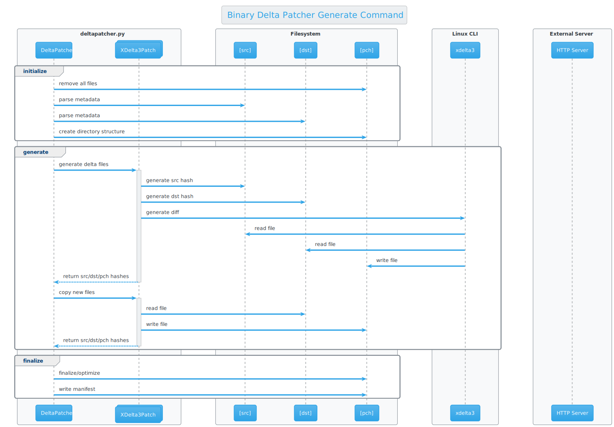

# [interactivefitness-deltapatcher](README.md) <!-- omit in toc -->


This is delta patching software which extends [Xdelta](http://xdelta.org/) to patch directories instead of just individual files. Source and destination directories are analyzed to determine differences, and a patch directory representing their differences in generated. This patch folder can then be used to reconstruct the destination directory from the original source directory.

```
| Tool         | Source    | Destination | Patch         |
| ------------ | --------- | ----------- | ------------- |
| XDelta3      | file1.dat | file2.dat   | patch.xdelta3 |
| patchtool.py | folder1/  | folder2/    | patch/        |
```

- [Setup](#setup)
- [Commands](#commands)
  - [Generate](#generate)
  - [Apply](#apply)
  - [Validate](#validate)
  - [Analyze](#analyze)
- [Benchmarking](#benchmarking)
  - [Performance](#performance)
  - [Patch size](#patch-size)
- [Source](#source)
  - [Style](#style)
  - [Testing](#testing)


# Setup

The script depends on python3 that comes standard with Ubuntu 18.04 and XDelta3 from Universe
 
On ubuntu this can be installed as follows:

```bash
apt-get install python3-full xdelta3
```

# Commands

```
usage: patchtool.py [-h] [-s SRC] [-d DST] -p PCH [-x [SPLIT [SPLIT ...]]]
                    [-c {bz2,gz,none}] [-v]
                    [{generate,apply,validate,analyze}]

Example to generate patch directory, apply it and then validate:
  python3 patchtool.py generate -s src_dir -d dst_dir -p patch_dir
  python3 patchtool.py apply -s src_dir -d out_dir -p patch_dir
  python3 patchtool.py validate -s src_dir -d out_dir -p patch_dir

```


## Generate

Patch directories are created using the "generate" command. The resulting directory will contain a manifest.json and the set of differences. By default, bz2 compression is used on individual patch files to reduce total patch size. You can switch to gzip compression using "-c gz" or disable compression entirely using "-c none" parameter.

Patches may include an optional "--http_base" command which is used to construct HTTP urls to download files which fail to patch correctly. If this parameter is not specified, there will be no fallback to HTTP. Additionally, the "--http_tool" parameter can be used to specify an external command to handle file downloads. This tool will be provided the environment variables $HTTP_URL, $HTTP_FILE, $HTTP_USER, $HTTP_PASS. The built-in HTTP downloader also supports the parameters "--http_user" and "--http_pass" for basic authentication. The built-in HTTP downloader will resume failed downloads if "apply" is called again. 

Each of the "--http_*" parameters are written to the manifest file if they are provided to the "generate" command. Otherwise, they can be applied to the "apply" command to override any values which exist in the manifest file.



## Apply

Patch directories are applied using the "apply" command. Patches can be applied into a new destination folder, or "in-place" over the top of the source folder. All file operations are atomic so an interrupted apply command can be resumed by running the command again. By default, the patch operation will ignore errors and continue patching any valid files it is able to. The parameter "--stop-on-error" can be used to stop immediately on the first error. Only operations without errors will be committed to disk, so errors will not result in a corrupted destination directory.


## Validate

The validate command allows validation between src/dst/pch directories. The patch directory parameter is mandatory, but src and dst are optional. If both src and dst directories are provided, validation is a bit more thorough as it will validate the manifest against each src/dst directory as well as comparing the src/dst directories directly.


## Analyze

The analyze command does a quick analysis to detect potential file size savings if additional features are implemented in the patcher in the future. No files are changed, the files are analyzed and a summary displayed.


# Benchmarking

Performance and file size are important benchmarks for this tool. Some measurements are provided in this section

## Performance

With arbitrary hardware looking to patch ExpressoGame with Unreal Engine 4.14.3 to Unreal Engine 4.25.1 we saw the following elapsed times with the different compression settings enabled:

```
| Task         | None   | bzip2  | gzip   |
| ------------ | ------ | ------ | ------ |
| Generation   | 3m 41s | 4m 20s | 3m 51s |
| Copy of 4.25 | 7m 35s | -      | -      |
| Apply        | 4m 10s | 4m 46s | 4m 17s |
| Validate     | 1m 17s | 1m 12s | 1m 17s |
```

Patch generate/apply operations are done using Python's multiprocessing module to distribute load across all available CPUs. Tasks are arranged to avoid any redundant hash operations and to maximize locality of file i/o. Source files are loaded into memory while being hashed, piped to xdelta3 and optionally to bzip2 or gzip, then piped back to disk before being atomically swapped into place if all operations and hash checks were successful. Care is taken to avoid any unnecessary/redundant file reads or writes.


## Patch size

Generating a patch between ExpressoGame versions, we saw the following patch folder sizes with the different compression settings enabled:

```
| Directory | None     | bzip2   | gzip    |
| --------- | -------- | ------- | ------- |
| 4.14.3    | 36.10 GB | -       | -       |
| 4.25.1    | 35.90 GB | -       | -       |
| Patch     | 1.75 GB  | 0.99 GB | 1.03 GB |
```

# Source

The binary delta patcher is implemented using Python >= 3.6 with standard import modules.

## Style

This uses [flake8](https://flake8.pycqa.org/en/latest/) for Style Enforcement.
Any overrides can be found in the `.flake8` file in the root of the project.

## Testing

It uses [pytest](https://docs.pytest.org/en/stable/contents.html) and the tests live in the `tests` directory
